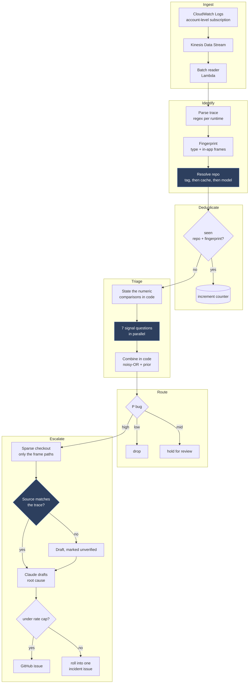

# Architecture

One deployment per AWS account. It captures every log group, resolves which repository each failure belongs to, decides whether the failure is ours, and opens an issue when it is confident enough to be worth someone's attention.

Deterministic code is the skeleton. A 4B model is called at the points where the answer needs reading rather than computing.

## Flow

Shaded steps call a model. Everything else is ordinary code.

## Where the 4B is used, and why there

Today's measurements set the rule: the model is reliable at "does this text have property P" and "do these two mean the same", and unreliable at arithmetic and multi-hop attribution. Every use below is the first kind.

| Step | Question | Why not code |
|---|---|---|
| Resolve repo | Which repository owns `Orders.PaymentService`? | Only when the resource carries no tag. Cached per namespace, so it runs once per new namespace, not per log. |
| Classify frames | Is this frame application code or a library? | Otherwise needs a hand-maintained namespace config per service. Cached the same way. |
| Parse fallback | What is the exception type and the top frames? | Only when no runtime parser matches. Covers the long tail without a parser per format. |
| Triage tree | 7 grounded signals over the evidence | The measured core. See [FINDINGS.md](FINDINGS.md). |
| Verify source | Could this code throw this exception here? | Detects a stale checkout without resolving a commit. |

Language detection is deliberately absent: stack trace formats are distinctive enough that a regex is exact and free.

## Two loops that must not close

**Self-ingestion.** The pipeline writes logs. If the account policy captured them, triaging would generate logs that trigger triage. AWS documents this as a recursion that runs up ingestion billing.

Our log groups are excluded from the account policy through `selectionCriteria`. Self-triage instead runs on a **schedule that queries those groups**, so the loop is broken structurally rather than by a filter that one typo could undo.

**Blast radius.** A bad deploy breaks fifty services at once. Unchecked, that is fifty issues and thousands of model calls while nobody is watching. Three brakes:

- Fingerprint counters. The ten-thousandth occurrence increments a number rather than re-triaging, which is deduplication doing double duty as a rate limiter.
- A cap per repository per hour, with the overflow rolled into one incident issue rather than dropped.
- A global circuit breaker that trips and notifies instead of filing.

## Which commit was running

The escalation reads source, so it has to read the right version.

Designed for, in order of fidelity: the commit injected into the build and emitted with every error; OpenTelemetry `service.version`; a deployment registry mapping service and time window to a commit; and finally the timestamp against that registry.

None of it is certain, so the pipeline **verifies instead of assuming**. After checking out the frame paths it asks whether the code at those frames could produce this exception, matching on the method being present and capable of the throw rather than on exact line numbers, since line drift is normal even at the right commit. A drafted issue states what it read and whether verification passed:

> Analysed against `main@abc1234`. Frame verification: 1 of 3 matched, so this may not be the code that ran.

## Choices made

**Step Functions, not one big handler.** The pipeline branches, retries per step, and fans out seven parallel calls. The execution history is also the audit trail for why a log did or did not become an issue, which matters the first time it files something wrong.

**Kinesis from the start, not subscription straight to Lambda.** A service that starts log-spamming would otherwise exhaust account concurrency.

**Lambda, not AgentCore.** AgentCore solves session duration beyond 15 minutes and per-session isolation. Reading source named by a stack trace is targeted retrieval plus one model call, bounded in seconds. If following references beyond one hop turns out to be routinely necessary, that is the signal to revisit.

**NativeAOT on `provided.al2023`.** Init duration is 92 ms against a Python cold start spent importing an SDK.
