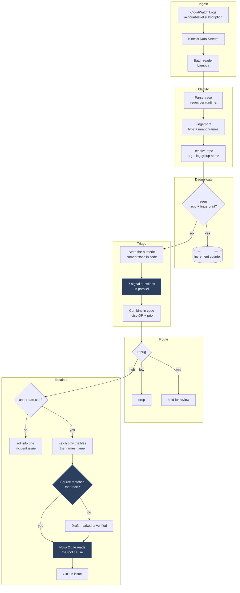

# Architecture

One deployment per AWS account captures every log group, resolves the repository each failure belongs to, decides whether the failure is ours, and opens an issue when confident enough. Deterministic code calls a 4B model where an answer needs reading rather than computing.

## Flow

Shaded steps call a model.

## Where the 4B is used, and why there

Every model call but one is the 4B readout. The exception is the root cause paragraph of a filed issue: `Diagnosis.DiagnoseAsync` sends the trace and the fetched files to a managed Bedrock model (`DiagnosisModelId`, defaulting to Nova 2 Lite through the `eu.` inference profile) once per issue, after the tree has said ours and the caps have said file. That ordering keeps this expensive generative call rare.

As measured, the model is reliable at "does this text have property P" and "do these two mean the same", and unreliable at arithmetic and multi-hop attribution. Every use below is of the first kind.

| Step | Question | Why not code |
|---|---|---|
| Triage tree | 7 grounded signals over the evidence | The measured core. See [FINDINGS.md](FINDINGS.md). |
| Verify source | Could this code throw this exception here? | Detects a stale checkout without resolving a commit. |

Stack trace formats are distinctive enough for a regex to identify the runtime, so there is no language detection step. The repository is the GitHub organisation plus the log group's resource name, which is wrong for a service named differently from its repository; a model call cached per namespace is the path to resolving those.

## Self-ingestion and blast radius

**Self-ingestion.** If the account policy captured the pipeline's own logs, triage would generate logs that trigger more triage, a recursion AWS documents as running up ingestion billing.

Both log groups the pipeline writes to are named from the stack name (the triage function's `FunctionName` and the state machine's `Name`) and excluded from the account policy by exact name through `SelectionCriteria`'s `NOT IN` list (the `ExcludedLogGroupNames` parameter in `infra/ingest.yaml`). The state machine logs with `IncludeExecutionData` off: its execution input is the log line that started it, and logging that input would close the loop despite the exclusions. State transitions are still recorded, and losing the input is the right trade against a billing incident.

**Blast radius.** A bad deploy can break fifty services at once, which unchecked means fifty issues and thousands of model calls with nobody watching. Three brakes:

- Fingerprint counters. The ten-thousandth occurrence increments a number instead of re-triaging, so deduplication doubles as a rate limiter.
- A cap per repository per hour, with the overflow rolled into one incident issue rather than dropped.
- A global circuit breaker that trips and notifies instead of filing.

## Which commit was running

Escalation reads source, so it needs the version that ran. The design covers, in order of fidelity: the commit injected into the build and emitted with every error; OpenTelemetry `service.version`; a deployment registry mapping service and time window to a commit; and the timestamp against that registry.

None of these is certain, so the pipeline verifies rather than assumes. After checking out the frame paths it asks whether the code at those frames could produce this exception, matching on the method being present and able to throw rather than on line numbers, which drift even at the right commit. A drafted issue states what it read and whether verification passed:

> Analysed against `main@abc1234`. Frame verification: 1 of 3 matched, so this may not be the code that ran.

## Choices made

**Step Functions rather than one handler.** The pipeline branches, retries per step and fans out seven parallel calls. The execution history is the audit trail for why a log did or did not become an issue.

**Filtering at capture.** The account subscription's filter pattern keeps only lines mentioning an error, exception, traceback or panic. Capture is the earliest and cheapest point to cut volume: other lines never reach Kinesis, are not billed as stream records and do not wake a consumer.

**Kinesis from the start.** Without it between the subscription and Lambda, a service that starts log-spamming would exhaust account concurrency.

**Lambda rather than AgentCore.** AgentCore addresses sessions longer than 15 minutes and per-session isolation. Reading source named by a stack trace is targeted retrieval plus one model call, bounded in seconds. Routinely needing to follow references beyond one hop would be the reason to revisit this.

**NativeAOT on `provided.al2023`.** Init takes 92 ms, against a Python cold start spent importing an SDK.
